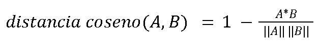

# Identificación de Plagio en Código usando Redes Neuronales

<p align="right">
    
</p>

## 📝 Descripción

Proyecto académico para la materia Desarrollo de aplicaciones avanzadas de ciencias computacionales. Este artículo y repositorio implementa un modelo de aprendizaje supervisado con TensorFlow Keras para la identificación de plagio en bloques de código en el lenguaje Java. Se ha desarrollado con la técnica de Aprendizaje Supervisado. Esta es una subárea del Machine Learning en la que el modelo se entrena para identificar patrones alimentándose de un conjunto de datos con etiquetas (en este caso, utilizando 2 etiquetas). Se busca que el sistema realice una tarea de identificación donde pueda señalar la copia de código, el porcentaje de similitud entre bloques de código y una decisión de si el código es plagiado o no.

_El análisis de cada modelo está entre los artículos escritos de cada uno en pdf más arriba._

## 📘 Introducción

En 2024, el mercado global de la IA alcanzó un valor de 2,41 billones de dólares, y se proyecta que para 2034 supere los 30 billones, con una tasa de crecimiento anual compuesta del 32,4% . Tras el nacimiento del internet y, con ello, la automatización de soluciones, el avance del aprendizaje automático, entre otras tecnologías, se ha explotado al nivel que conocemos hoy el tema de la Inteligencia Artificial. De aquí nace el concepto de la Cuarta Revolución Industrial o Industria 4.0, la cual consiste de un fenómeno caracterizado por la convergencia y aceptación de diversas tecnologías de áreas físicas, digitales y biológicas, entre otras, en especial en los últimos años que, similar a la carrera al espacio, ahora existe la carrera entre empresas y países de quién desarrolla la Inteligencia Artificial más poderosa del mundo.

Sin embargo, este auge y rápido crecimiento de las tecnologías como la IA han traído consigo no sólo lo bueno, sino también han traído nuevas preocupaciones y dudas en múltiples ámbitos, entre ellos el tema de la presencia de estas tecnologías en la educación de hoy en día. En el contexto educativo y profesional, el plagio, especialmente en el código fuente, se ha convertido en un problema cada vez más frecuente. Herramientas como ChatGPT, GitHub Copilot y otros generadores de código automatizado, aunque útiles para aprender y mejorar la productividad, también facilitan el copiado y reutilización de fragmentos de código sin atribución adecuada. Según las estadísticas, varias universidades han reportado aumentos del 50% en casos de plagio en carreras de ingeniería informática entre 2020 y 2023, según estudios recogidos por el Journal of Computing Sciences in Colleges (2023). Esto plantea desafíos importantes tanto para docentes que buscan evaluar conocimientos, como para empresas que deben proteger sus activos tecnológicos. Como en el tema de seguridad, por cada parche que se implemente o se trabaje, ya hay 3 tecnologías más nuevas que te permiten darle la vuelta. Actualmente, la demanda de las herramientas capaces de analizar grandes volúmenes de código y detectar patrones de similitud va en aumento, en especial debido a que los métodos tradicionales se están quedando obsoletos en tiempo, eficiencia y entendimiento. Claro, se pueden utilizar búsqueda de cadenas o análisis léxico para el desglose del código bajo estudio, pero no son suficientes para detectar plagios más sofisticados, como el cambio de nombres de variables o la reorganización de bloques de código que son los cambios usuales que se realizan después de haber copiado algo.

En este contexto, las redes neuronales artificiales aparecen como una posible solución. Gracias a su capacidad para aprender representaciones abstractas y captar similitudes más allá de la superficie del texto, estos modelos permiten detectar plagio incluso en casos en que el código ha sido reestructurado para evadir comparadores tradicionales. Una herramienta de este tipo puede analizar no solo la sintaxis, sino también la semántica del código, identificando fragmentos que conservan su lógica aunque hayan sido modificados superficialmente. Esto es especialmente útil en lenguajes como C++, donde la flexibilidad del lenguaje facilita las técnicas de ocultamiento de plagio.

## 📚 State of the Art

Al igual que con el tema de la ciberseguridad que por cada parche y solución que salga a la luz salen múltiples tecnologías y herramientas nuevas para cumplir con el trabajo de un atacante, el campo del plagio en código fuente es un desafío que evoluciona constantemente debido a la velocidad de desarrollo de automatización de soluciones e inteligencia artificial en lo que conocemos como la Cuarta Revolución Industrial o la Industria 4.0. Bajo este contexto, son muchos los estudios e investigaciones realizados para ofrecer un mejor entendimiento al tema y orientar el desarrollo de herramientas más precisas y escalables que puedan usarse para solucionar la problemática que presentamos hoy. Como parte de este artículo, se analizaron algunos de estos trabajos ya existentes para realizar un acercamiento a nuestra solución. Entre estos, los siguientes artículos:

```
[1] O. Karnalim, S. Budi, H. Toba, and M. Joy, “Source Code Plagiarism Detection in Academia with Information Retrieval: Dataset and the Observation,” Informatics in Education, vol. 18, no. 2, pp. 321–344, 2019.

[2] D. Guo et al., “GRAPHCODEBERT: PRE-TRAINING CODE REPRESENTATIONS WITH DATA FLOW,” presented at the ICLR 2021, Sep. 2021.

[3] A. Eppa, “Source Code Plagiarism Detection: A Machine Intelligence Approach,” in 2022 IEEE Fourth International Conference on Advances in Electronics, Computers and Communications (ICAECC), 2022, pp. 1–5.

[4] S. Surendran, “Plagiarism Detection in Source Code using Machine Learning,” Master’s Thesis, University of Windsor, Windsor, ON, Canada, 2024.
```

El trabajo de Karnalim et al. [1] destaca la necesidad de un dataset estandarizado y comprensivo para la evaluación de detectores de plagio. Su contribución principal es la creación de un repositorio de datos público que simula variados escenarios de plagio, incluyendo modificaciones avanzadas y la intención subyacente de plagiar (como por ejemplo el cambio de variables cuando el código es similar). El método inicial de acercamiento al problema se basa en la recuperación de información (IR) para establecer líneas base para la detección. La principal relevancia de este trabajo para nuestro proyecto reside en la metodología de construcción y curación de datasets. Para entrenar una red neuronal que pueda discernir entre el plagio y código original en código Java, es imperativo disponer de un dataset voluminoso que refleje la complejidad de las modificaciones de código plagiado, dejando al modelo aprender patrones semánticos robustos, no solo léxicos o sintácticos.

Dentro de Guo et al. [2] abordan un problema fundamental en el procesamiento de lenguajes de programación: la representación del código. Argumentan que los modelos pre-entrenados existentes suelen tratar el código como una mera secuencia de caracteres y tokens, ignorando su estructura al igual que su semántica. Su propuesta es un modelo pre-entrenado que se llama GraphCodeBERT que integra el flujo de datos (data flow) como una estructura semántica particular. El flujo de datos relaciona las variables dentro de la funcionalidad, proporcionando una comprensión más profunda de la lógica del código. Este acercamiento es aplicable a la detección de plagio en Java de este proyecto. El plagio usualmente se refiere a transformaciones que alteran la forma superficial del código como cambios de nombres de variables y funciones pero mantienen el mismo comportamiento funcional. Al emplear representaciones de código que encapsulan el flujo de datos, las redes neuronales aprenden a identificar similitudes a nivel semántico, detectando plagio incluso en presencia de refactorizaciones significativas, cambios de nombres o inserciones de código externo. También argumenta el uso de una arquitectura híbrida usando, aparte de un modelo pre-entrenado como CodeBERT, métodos simbólicos como los ASTs (Árboles de sintaxis abstracta por sus siglas en inglés). Esta dualidad permite un rango mayor para la identificación de múltiples tipos de plagio tanto sintáctico como léxico y semántico.

Mientras tanto, Eppa [3] busca investigar la aplicación de métodos de aprendizaje automático y Deep Learning para la detección de plagio. El estudio evalúa la efectividad de diversas técnicas, incluyendo KNN, SVM, árboles de decisión, redes neuronales recurrentes (RNNs) y redes transformadoras basadas en atención, sobre un dataset de pares de código. Los resultados demuestran que las metodologías de aprendizaje automático y profundo superan consistentemente a los detectores de plagio tradicionales basados en texto. Ofrece un punto de partida para la selección y experimentación con arquitecturas de redes neuronales, como RNNs y Transformers, que han demostrado éxito en tareas de procesamiento de lenguaje natural y código. La metodología de preparación de un dataset de pares de código para entrenamiento y evaluación es un componente clave a emular.

La tesis de Surendran et al. [4] refuerza la viabilidad de la detección de plagio de código fuente utilizando aprendizaje automático. Presenta una exploración de las metodologías como el preprocesamiento de código, la extracción de características y la evaluación comparativa de modelos con diferentes capacidades. Proporciona una base para identificar las técnicas más efectivas de preprocesamiento de código Java con su estudio en los temas de normalización, tokenización, análisis de árbol de sintaxis abstracta (ASTs) y las métricas de evaluación para medir el rendimiento de los modelos de redes neuronales en la detección de plagio. Esta es la fuente principal para este artículo. Consistiendo de 84 páginas, la tesis de la estudiante de la Universidad de Windsor es la fuente más completa que se encontró para el desarrollo de este modelo.

En estos y varios papers más se habla de 6 clasificaciones o tipos de plagio que se estudian a través de los modelos desarrollados en orden de más sencillo de identificar a más complejo.

1. El tipo más sencillo de entender y explicar es el plagio literal, también conocido como la copia idéntica. Esto quiere decir que se reproduce un código exactamente igual al código fuente de un autor por parte de otra persona sin algún tipo de alteración. Este tipo de plagio se caracteriza por un porcentaje de similitud de entre 95-100%, casi perfecta en la secuencia de caracteres, tokens o líneas de código. Incluso llega a mantener la indentación del código, los mismos nombres para variables o funciones e incluso comentarios del código original. Al igual que es sencillo de entender, es sencillo de encontrar. Se puede hacer a través de herramientas basadas en comparación textual sin necesidad de alguna tecnología que deba procesar el texto como código literal (en nuestro caso, el uso de javalang). No requiere como tal de una red neuronal para hacer la comparación ya que puede hacerse desde una aplicación mucho más sencilla usando métodos cuantitativos como TF-IDF o Cadenas de Markov, pero también se puede usar una red neuronal.

2. En segundo lugar tenemos el plagio con mínimas modificaciones que, como lo dice su nombre, se ocupa meramente de hacer cambios superficiales al código fuente. Este tipo de plagio busca eludir la detección de su copia sin alterar la funcionalidad del bloque. Incluye modificaciones tales como el renombrado de identificadores de variables, métodos y/o clases, la alteración o eliminación de comentarios, ajustes de formato de indentación o añadir “código muerto” que no cumple con ninguna función simplemente para realizar un cambio. En este caso, ya no es tan sencillo de identificar en comparación textual debido a que con los renombramientos de variables y otros cambios de los anteriormente mencionados, cuando un sistema esté analizando caracter por caracter, no se va a topar con mucho plagio. Es por esto que requerimos un análisis más profundo de la estructura léxica a través del uso de tokens y sintáctica haciendo uso de árboles de sintaxis abstracta (ASTs). Estas herramientas igualmente pueden desarrollarse sin necesidad de una red neuronal, pero aquí empieza a demostrarse más el potencial de uso de estas mismas.

3. A continuación, hablaremos del plagio con reestructuración estructural. Aquí se realizan cambios más significativos al código manteniendo su funcionalidad. Esto se puede lograr reordenando sentencias independientes, cambiar el uso de estructuras de control con otros equivalentes, fusionar o dividir bloques de código, entre otros cambios. En este tipo de plagio no sólo estamos hablando del parafraseo de palabras reservadas o variables, sino que también de una reorganización del código donde en vez de una sóla función pueden existir tres con diferentes secciones del código original. La detección de este tipo de plagio requiere de un análisis estructural similar al anterior, haciendo uso de árboles de sintaxis abstracta (ASTs) en su totalidad de profundidad. El uso de redes neuronales a partir de este punto es ampliamente sugerido, entrenadas con representaciones del código o usando embeddings semánticos como el enfoque de GraphCodeBERT para realizar un análisis que trascienda de las diferencias superficiales.

4. Después se encuentra el plagio con equivalencia semántica o equivalencia algorítmica. En este caso, el código plagiado puede ser sintácticamente muy distinto al original, sin embargo implementa el mismo algoritmo o produce la misma funcionalidad que el código original. Las características de este tipo incluyen el cambio, ahora en vez de palabras reservadas, del algoritmo por otro que haga lo mismo, cambiar las librerías o APIs que se utilizan o, incluso, la optimización o desoptimización intencional del código para ocultar el plagio del mismo. Identificar la equivalencia semántica demanda un análisis funcional profundo que sea insensible a las variaciones sintácticas. Aquí el uso de flujo de datos como el que fue utilizado en el artículo de Guo et al. [2] y el flujo de control es crítico. Una red neuronal debe ser capaz de generar una o múltiples representaciones de código que encapsulan su “intención” subyacente, lo cual requiere técnicas avanzadas de análisis estático o dinámico.

5. También existe el plagio mixto, el cual involucra no sólo un código original sino diversos fragmentos de código de diferentes fuentes, algunas veces complementado con código nuevo para darle coherencia. Para el análisis y detección de este tipo de plagio hay un gran desafío: la necesidad de comparar secciones de código más pequeñas en lugar del programa completo. Para esto se necesita usar subgrafos, sub-ASTs o fragmentos de embeddings, además de la memoria y capacidad del dispositivo para correr el análisis.

6. Finalmente se encuentra el plagio de ideas o conceptos. Este se sitúa en el nivel más abstracto de todos los tipos mencionados aquí. No existe una copia directa del código, sino la apropiación de la lógica algorítmica, el diseño de la solución o la estrategia particular de un autor para resolver un problema. Aunque el código puede ser completamente original, la base conceptual ha sido plagiada. Este tipo de abstracción presenta un reto para los sistemas de detección automatizados como lo es una red neuronal. Para el desarrollo de un sistema así, el enfoque principal debe dirigirse a la detección robusta del plagio literal, con mínimas modificaciones, con reestructuración estructural y con equivalencia semántica. Esto implica un preprocesamiento sofisticado de datos (generación de ASTs, grafos de flujo de datos y control), el diseño de arquitecturas de redes neuronales capaces de procesar estructuras complejas como GNNs o mediante el uso de Transformers, y la construcción de un dataset diverso que cubra adecuadamente estas tipologías de plagio.

## 📂 Sobre el Dataset

Recuperado de: [4] Slobodkin, “ConPlag: a Dataset of Programming Contest Plagiarism in Java”, Sadovnikov, 2022. [En línea]. Disponible: https://zenodo.org/records/7332790 . [Accedido: 3-jun-2025].

La evaluación de algoritmos y sistemas para la detección de plagio en código fuente depende de la disponibilidad de datasets estandarizados y representativos. En este contexto, el dataset ConPlag surge como una herramienta valiosa, habiendo sido diseñado para facilitar la investigación en la detección de plagio en lenguajes de programación. Su estructura está pensada para permitir la evaluación de la robustez de los detectores frente a diversas técnicas de ofuscación de código.

```
ConPlag Dataset
├── resources
│ ├── bplag
│ ├── jplag
│ ├── sherlock
│ └── sim
└── scripts
│ ├── __init__.py
│ ├── algorithm.py
│ ├── bplag.py
│ ├── dolos.py
│ ├── jplag.py
│ ├── metrics.py
│ ├── moss.py
│ ├── runner.py
│ ├── sherlock.py
│ ├── sim.py
│ └── utils.py
└── versions
│ ├── bplag_version_1
│ ├── bplag_version_2
│ ├── version_1
│ ├── version_2
│ ├── labels.csv
│ ├── test_pairs.csv
│ └── train_pairs.csv
└── README.md
└── requirements.txt

```

**Dentro de Resources:**

**Bplag** es una herramienta de detección de plagio de código fuente académico basado en el comportamiento. Representa un conjunto de entregas de tareas en un formato gráfico que representa su comportamiento dinámico de ejecución. Luego, compara estos gráficos para medir la similitud de comportamiento. Una alta similitud indica plagio. (https://github.com/hjc851/BPlag)

**JPlag** encuentra similitudes entre pares de programas. Detecta con fiabilidad el plagio y la colusión en el desarrollo de software, incluso cuando está ofuscado. Todas las similitudes se calculan localmente; el código fuente y los resultados de plagio nunca se publican en línea. (https://github.com/jplag/JPlag)

**Sherlock** es un programa que encuentra similitudes entre documentos textuales. Utiliza firmas digitales para encontrar fragmentos de texto similares. Una firma digital es un número que se forma al convertir varias palabras de la entrada en una serie de bits y unirlos para formar un número. (https://github.com/diogocabral/sherlock)

**Sim** se utiliza para medir la similitud entre dos programas de computadora en C. Es útil para detectar plagio entre un conjunto grande de tareas. Se enfoca meramente en fragmentos de texto. (https://github.com/mpanczyk/sim)

**Dentro de Scripts:**

Aquí se encuentran los scripts para correr los programas que están dentro de Resources al igual que mandar llamar otras herramientas necesarias para desglosar y comprender los archivos en evaluación de plagio.

**Dentro de Versions:**

**Versiones:** En las primeras 4 carpetas se encuentran los archivos en formato .java donde se encuentran los bloques de código a comparar en búsqueda de la detección de plagio.

**Labels:** Dentro del archivo de labels.csv se encuentran los pares que se comparan en busca de la detección de plagio junto con la etiqueta binaria que define un valor de 0 como ‘no plagio’ y el valor 1 como ‘plagio detectado’. Estas etiquetas son las que mantienen nuestro modelo en el área de aprendizaje supervisado y permiten que sea más sencillo entrenar el modelo.

**Test y train pairs:** Los archivos test_pairs.csv y test_pairs.csv contienen solamente los pares de identificadores de archivos a comparar. Estos documentos representan la división de archivos y comparaciones que entran para entrenar el modelo para posteriormente probarlo con los archivos y pares de test.

## 💡 Propuesta de Solución

Como se mencionó en la sección de Estado del Arte, la base principal de este proyecto ha sido la tesis de Surendran et al. [4]. Se hizo el análisis de la propuesta en la tesis y se determinó que la solución para este proyecto sería el uso de una red neuronal convolucional (CNN) y una red neuronal recurrente (RNN), junto con una red de memoria larga a corto plazo (LSTM) y un modelo pre-entrenado (PTM), en este caso estaremos usando GraphCodeBERT. Para el preprocesamiento de datos, necesitaremos usar CodeBERT para realizar la tokenización del código y los embeddings de los bloques de código. Esto nos permite hacer el análisis léxico y sintáctico, además de agregar el uso de un AST para la evaluación a profundidad de la sintaxis de los códigos a revisar.

## 🧹 Preprocesamiento de Datos

GraphCodeBERT (de ahora en adelante referenciado como CodeBERT) es un modelo pre-entrenado (PTM) para lenguajes de programación. A diferencia de los PTMs que mencionan los artículos referenciados en este artículo, CodeBERT no trata el código como una mera secuencia de tokens, sino que reconoce y explota la estructura inherente del código, específicamente el flujo de datos (data flow). Este enfoque permite al modelo analizar la semántica del código relacionando el valor y función de las variables e interacciones que definen la lógica del programa, proporcionando una representación más contextualmente informada de la representación del código.

Para este proyecto, CodeBERT se utiliza en el procesamiento de datos en la tokenización y embedding de bloques de código para permitir la profunda evaluación del léxico y sintaxis en los códigos. La capacidad de detectar plagio depende de la habilidad del sistema para identificar similitudes funcionales y lógicas, incluso cuando el código ha sido modificado. Las representaciones de código generadas por CodeBERT permiten que los modelos de redes neuronales vean más allá de estos cambios sintácticos. Esto facilita la detección de plagio semántico, donde la lógica del código es copiada a pesar de diferencias estructurales. Por lo tanto, CodeBERT o los principios que lo sustentan son fundamentales para desarrollar un detector de plagio que pueda identificar la "intención" del código.

**Tokenización**

El primer paso, claro, fue cargar los datos de pares y códigos al programa seguido de la tokenización del lenguaje en los archivos. La tokenización es un proceso que se ocupa de descomponer los datos (digamos un código de 13 líneas) en unidades fáciles de “consumir”, sea por palabra o por caracter. Tras una breve investigación, se definió que crear los tokens por caracter es más eficiente cuando se trata de análisis de código ya que hace de la evaluación un proceso más flexible, adaptable a cambios y más preciso para comparar y calcular la similitud entre dos bloques de código. Este proceso inicial es de vital importancia porque nos ayuda a transformar la entrada del código fuente de un formato textual bruto a una secuencia estructurada que es manejable para el análisis computacional. Para la identificación de plagio, los algoritmos pueden comparar secuencias de tokens utilizando métricas de similitud. Este acercamiento es particularmente efectivo para detectar plagio literal y plagio con mínimas modificaciones, ya que este método se enfoca en secuencia de tokens en el orden que tienen o introducen solamente ligeros cambios. Aunque la tokenización es un proceso que por sí solo no es suficiente para detectar plagio con reestructuraciones del código o equivalencias semánticas, es un paso inicial para el desarrollo de herramientas que puedan hacerlo a través de un análisis más complejo como los árboles de sintaxis abstracta (ASTs).

**Embeddings**

Los embeddings son representaciones densas y de baja dimensión de entidades (como palabras, tokens o fragmentos de código) que se encuentran en un espacio vectorial continuo. En este espacio, las entidades con significados o propiedades similares a estos se mapean a puntos cercanos, realizando así las comparaciones al igual que relaciones semánticas y sintácticas en el código analizado. A diferencia de representaciones dispersas o basadas en recuentos como los tokens, los embeddings permiten a las redes neuronales procesar la información más eficientemente y capturar matices más complejos del lenguaje como la semántica. La similitud entre dos fragmentos embebidos se calcula a partir de la distancia en el campo vectorial que comparten los fragmentos. Esta distancia se infiere usando una métrica de similitud llamada distancia coseno. La distancia coseno mide la diferencia entre dos vectores usando el ángulo entre ellos y se calcula como 1 menos la similitud cosenoidal:

<p align="center">
    
</p>

Un modelo pre-entrenado (PTM) como CodeBERT demuestra ser una herramienta eficaz siendo que es capaz de producir embeddings que encapsulan la semántica y la lógica funcional del código. Estos embeddings permiten que un detector de plagio basado en redes neuronales identifique cuándo dos fragmentos de código tienen un comportamiento funcional idéntico o muy similar, incluso si su sintaxis es radicalmente diferente. Así, se proporciona una representación también de alto nivel que las redes neuronales pueden utilizar para aprender los patrones de plagio más allá de las similitudes superficiales del código Java.

**Etiquetas**

Después, asignamos las etiquetas correspondientes que se encuentran en el archivo labels.csv a los datos dentro de las carpetas de versiones. Las etiquetas son la diferencia entre el aprendizaje supervisado y no supervisado. Estas ofrecen una línea base para reconocer los patrones directos entre plagio y no plagio. El objetivo de la red es ajustar sus parámetros internos (pesos y sesgos) para minimizar la diferencia entre sus predicciones y las etiquetas de verdad fundamental. Mientras más claras y definidas sean las etiquetas en los datos mejor aprenderá el modelo. En este caso contamos con las etiquetas ‘sub1’ y ‘sub2’ que representan los 2 fragmentos de código que se van a comparar y la etiqueta ‘veredict’ que establece si el resultado de esa comparación es plagio o no plagio en valor binario.
